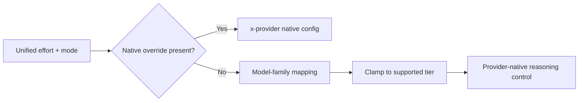

# Portable core, native edges

Portable does not mean every provider has the same API. It means you can express
the common intent once and let the selected adapter handle the provider's wire
format.

## What the portable layer does

Provider adapters recognize the common conversation fields they support. They
translate message roles and content, common generation controls, tool
definitions and results, image blocks, streaming events, and unified reasoning
controls.

The request remains a `serde_json::Value`, but it is not arbitrary pass-through
JSON. Each adapter builds a new native request from understood fields. An
unknown top-level field is not automatically forwarded to every provider.

Provider differences have three possible outcomes:

- **Translated:** the provider supports the intent under another field or
  structure.
- **Clamped or omitted:** the provider has a smaller vocabulary or cannot
  accept that control.
- **Sent natively:** the caller deliberately uses a provider extension.

Reasoning illustrates the choice:



The exact reasoning mappings belong in the
[reasoning guide](../guides/reasoning.md). The important concept is precedence:
an explicit native control wins; otherwise llmshim maps the portable intent to
what the selected model accepts.

## Native extensions

Three built-in adapters expose explicit native namespaces:

| Namespace | Destination |
|---|---|
| `x-openai` | Fields in the OpenAI Responses request body |
| `x-anthropic` | Anthropic Messages fields plus llmshim-specific header controls |
| `x-gemini` | Gemini request fields, including `thinkingConfig` handling |

There is no `x-xai` namespace. xAI's supported common controls are translated
directly to its Responses API shape.

In the Rust contract, an extension is a top-level request key:

```json
{
  "x-openai": {
    "reasoning": { "effort": "high", "summary": "auto" }
  }
}
```

In the proxy contract, put that same key inside `provider_config` because the
proxy merges `provider_config` into the core request:

```json
{
  "provider_config": {
    "x-openai": {
      "reasoning": { "effort": "high", "summary": "auto" }
    }
  }
}
```

Using a native extension intentionally reduces portability. A request that
depends on `x-openai` should not be expected to retain that behavior after its
model is changed to Anthropic or Gemini.

