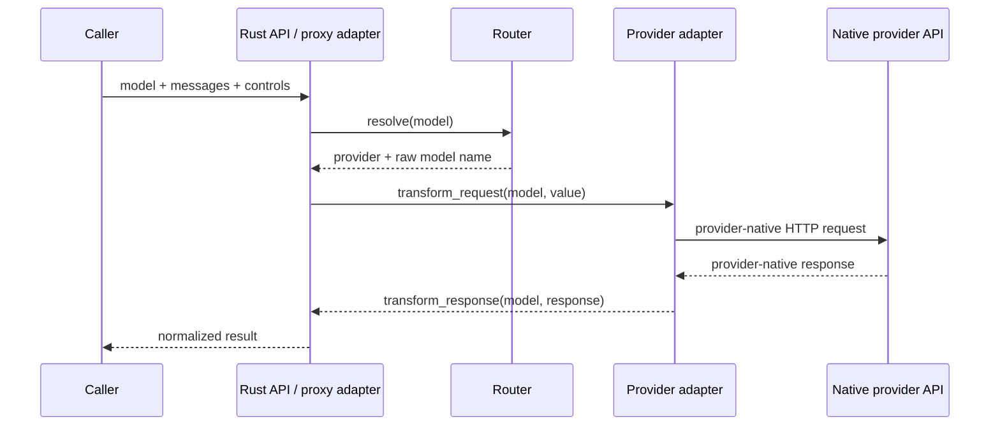

# How translation flows

Translation happens twice: once before the network request and once after it.

## 1. Resolve the model address

Every request contains a `model` string. `Router::resolve` turns that string
into two things:

- a registered provider adapter;
- the raw model name to send to that provider.

For example, `anthropic/claude-sonnet-4-6` selects the adapter registered as
`anthropic` and passes `claude-sonnet-4-6` to it. A bare model name can use
prefix inference instead. [Models and the Router](routing.md) covers the exact
rules.

Resolution chooses an adapter. It does not check the static model-discovery
list or choose a model based on prompt content.

## 2. Translate the outbound request

The Rust API receives the request as `serde_json::Value`. There is no canonical
Rust request struct between the caller and the providers. The selected
adapter's `transform_request` method reads the fields it understands and builds
the provider-native URL, headers, and JSON body.

This is where an OpenAI-style `messages` array becomes an Anthropic Messages
request, Gemini contents, or an OpenAI/xAI Responses request. Common controls
are translated here too.

## 3. Send the native HTTP request

The shared HTTP client sends the translated request to the selected provider.
Provider authentication belongs to this outbound request; callers do not send
one provider's key to another provider.

## 4. Translate the inbound response

The same adapter's `transform_response` method converts the provider-native
response into llmshim's normalized OpenAI Chat Completions-style value. Text,
tool calls, usage, and provider-returned reasoning are placed into that common
shape when present.

The proxy then performs one additional conversion into its compact
`ChatResponse`. This is why the Rust and proxy APIs share semantics without
sharing the same response envelope.

## Streaming follows the same boundary

Streaming changes the inbound step, not the model. Each provider emits its own
SSE event format. The adapter's third method, `transform_stream_chunk`, converts
individual provider events into normalized chunks. The Rust API yields those
chunks directly; the proxy converts them again into typed `content`,
`reasoning`, `tool_call`, `usage`, `done`, and `error` events.

