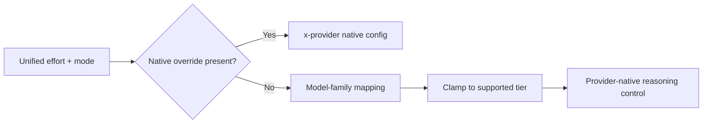

# Reasoning controls

llmshim exposes one reasoning vocabulary across providers. You state the
desired depth; the selected provider adapter maps it to what that model accepts.

> **Availability:** Rust: top-level fields · CLI: `high` by default · Proxy/clients: fields under `config`

## The two knobs

| Knob | Values | Meaning |
|---|---|---|
| `reasoning_effort` | `none` \| `low` \| `medium` \| `high` \| `xhigh` \| `max` | Requested thinking or reasoning depth |
| `reasoning_mode` | `standard` (default) \| `pro` | Requests substantially more model work, accepting higher latency and cost |

In a Rust request, both are top-level fields:

```json
{
  "model": "anthropic/claude-sonnet-5",
  "messages": [{"role": "user", "content": "Solve this carefully."}],
  "reasoning_effort": "high",
  "reasoning_mode": "pro"
}
```

In the proxy contract, put them under `config`:

```json
{
  "model": "anthropic/claude-sonnet-5",
  "messages": [{"role": "user", "content": "Solve this carefully."}],
  "config": {
    "reasoning_effort": "high",
    "reasoning_mode": "pro"
  }
}
```

Provider-returned reasoning is normalized as `reasoning_content` in Rust
responses and chunks, and as `reasoning` or a typed `reasoning` event through
the proxy. A provider or model may keep its reasoning hidden or return only a
summary.

## Portable intent or native control

Choose per request:

1. **Use the unified controls.** llmshim maps the requested effort and mode to
   the selected model family, clamping to the nearest accepted tier when the
   model has a smaller vocabulary.
2. **Use the provider's native dialect.** Pass an exact native object through
   `x-openai`, `x-anthropic`, or `x-gemini`. Native configuration wins over the
   unified controls.



See [Native provider controls](native-controls.md) for passthrough examples.

## Effort mapping tables

These mappings were verified against the live provider APIs. A bold value is a
clamp rather than a direct name-for-name mapping.

### OpenAI Responses API

| unified | gpt-5.6-sol/terra/luna | gpt-5.5 | gpt-5.5-pro / gpt-5.4-pro | gpt-5.4 / -mini / -nano |
|---|---|---|---|---|
| `none` | `none` | `none` | **`medium`** (pro tier rejects none) | `none` |
| `low` | `low` | `low` | **`medium`** | `low` |
| `medium` | `medium` | `medium` | `medium` | `medium` |
| `high` | `high` | `high` | `high` | `high` |
| `xhigh` | `xhigh` | `xhigh` | `xhigh` | `xhigh` |
| `max` | `max` | **`xhigh`** (max is 5.6-only) | **`xhigh`** | **`xhigh`** |

OpenAI receives `reasoning.effort`. Legacy `minimal` input is also accepted:
it remains native on gpt-5.5 and clamps to `low` where other listed families
would reject it.

### Anthropic Messages API

Adaptive models use `thinking: {type}` plus `output_config: {effort}`:

| unified | Fable 5 / 5.1 | Opus 5, Opus 4.7/4.8, Sonnet 5 | Opus/Sonnet 4.6 |
|---|---|---|---|
| `none` | `adaptive` + **`low`** | `thinking: {type: "disabled"}` | `thinking: {type: "disabled"}` |
| `low` | `adaptive` + `low` | `adaptive` + `low` | `adaptive` + `low` |
| `medium` | `adaptive` + `medium` | `adaptive` + `medium` | `adaptive` + `medium` |
| `high` | `adaptive` + `high` | `adaptive` + `high` | `adaptive` + `high` |
| `xhigh` | `adaptive` + `xhigh` | `adaptive` + `xhigh` | `adaptive` + **`max`** |
| `max` | `adaptive` + `max` | `adaptive` + `max` | `adaptive` + `max` |

Adaptive models think by default even when no reasoning config is sent.
On models that can disable thinking, `reasoning_effort: "none"` maps to disabled
thinking. Fable 5 and 5.1 always use adaptive thinking, so `none` maps to `low`.
Explicit native `thinking.type: "disabled"` or `"enabled"` is rejected locally
for Fable. Fable and Opus 5 omit `temperature`, `top_p`, and `top_k` regardless
of whether a thinking object was explicitly provided.

Fable behavior and its five effort levels follow Anthropic's
[migration guide](https://platform.claude.com/docs/en/models/fable-5-1/migration-guide)
and Models API. The low-effort and rejected-parameter paths are also checked
against the live API in this repository.

Pre-4.6 models such as Haiku 4.5 and Claude 3.7 use enabled thinking with a
token budget scaled from `max_tokens` and floored at 1024:

| unified | budget |
|---|---|
| `none` | no `thinking` key |
| `low` | 25% of `max_tokens` |
| `medium` | 50% |
| `high` | 75% |
| `xhigh` | 90% |
| `max` | `max_tokens - 1` |

### Gemini

Gemini uses the four-rung
`generationConfig.thinkingConfig.thinkingLevel` enum:

| unified | gemini-3.5-flash / 3.6-flash / 3.5-flash-lite / 3.1-flash-lite | gemini-3.7-flash (and gemini-3.1-pro) |
|---|---|---|
| `none` | `minimal` (zero thinking tokens) | **`low`** (this model cannot disable thinking) |
| `low` | `low` | `low` |
| `medium` | `medium` | `medium` |
| `high` | `high` | `high` |
| `xhigh` | **`high`** | **`high`** |
| `max` | **`high`** | **`high`** |

Gemini 3.7 Flash and Gemini 3.1 Pro reject both `minimal` and `thinkingBudget: 0`, so `none`
clamps to their `low` floor (verified live). Other flash models accept `minimal` and can disable thinking. The legacy integer `thinkingBudget` remains available only
through `x-gemini.thinkingConfig`.

### ChatGPT subscription

GPT-5.6 Sol, Terra, and Luna use the GPT-5.6 mapping above.
GPT-6 Astra preserves `low`, `medium`, `high`, `xhigh`, and `max`;
`none` and `minimal` clamp to `low` because Astra cannot disable reasoning.
The shared Responses translator applies this mapping to Astra through either
ChatGPT or API-key OpenAI. These effort values follow the
[official Astra model documentation](https://developers.openai.com/api/docs/models/gpt-6-astra).
Native `x-chatgpt.reasoning` overrides the unified mapping.

### xAI Responses API

xAI receives the nested native shape `reasoning: {effort}`:

| unified | grok-4.3 | grok-4.5 / grok-4.6 | grok-4.20-\*-reasoning / -non-reasoning |
|---|---|---|---|
| `none` | `none` | **`low`** | omitted |
| `low` | `low` | `low` | omitted |
| `medium` | `medium` | `medium` | omitted |
| `high` | `high` | `high` | omitted |
| `xhigh` | `xhigh` | `xhigh` | omitted |
| `max` | **`xhigh`** | **`xhigh`** | omitted |

grok-4.5 and grok-4.6 cannot disable reasoning, so `none` clamps to `low`. grok-4.20 models
are name-locked: reasoning on or off is encoded in the model name, and the API
rejects any reasoning parameter. llmshim therefore omits it for that family.

## Mode mapping: `reasoning_mode: "pro"`

| Provider / model | What `pro` does |
|---|---|
| OpenAI gpt-5.6 family, gpt-5.5-pro, gpt-5.4-pro | Native `reasoning.mode: "pro"` |
| OpenAI other models | One-tier effort bump (`low → medium → high → xhigh`) |
| Anthropic | One-tier effort bump (`low → medium → high → xhigh → max`) |
| Gemini | One-tier bump within its four-rung enum, capped at `high` |
| xAI effort-controlled models | One-tier bump, capped at `xhigh` |
| xAI grok-4.20 family | No effect because reasoning is name-locked |

Rules that hold across providers:

- `standard` is the default and is not sent on the wire.
- An explicit effort of `none` wins over `pro`; a request to turn reasoning off
  is not bumped back on, except where the model itself cannot disable it.
- `pro` without an effort lets OpenAI native-mode models select their own
  effort. Other models behave as a default `medium` bumped to `high`.

## Precedence

1. Native passthrough under `x-openai`, `x-anthropic`, or `x-gemini` wins and
   is not translated into another dialect. Anthropic also accepts top-level
   `thinking` and `output_config` in the Rust contract.
2. Otherwise, unified `reasoning_effort` and `reasoning_mode` are mapped and
   clamped according to the tables above.
3. With neither, the provider/model default applies. Anthropic adaptive models
   and Gemini 3.1 Pro think by default; most other families do not.

The non-obvious boundaries above were live-probed as of July 2026 and are
pinned by provider unit tests. Provider capabilities can change, so the
implementation and these tables must move together.
