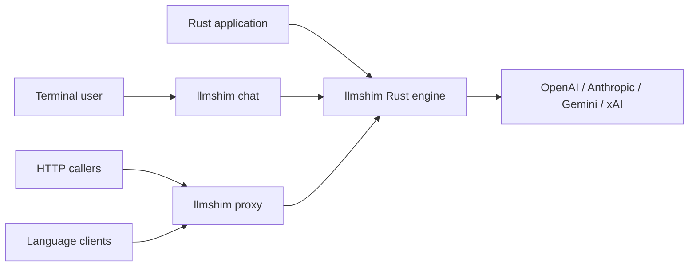
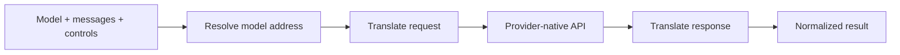

# One conversation shape. The model is the routing address.

Write a conversation once:

```json
{
  "model": "anthropic/claude-sonnet-4-6",
  "messages": [
    { "role": "user", "content": "Explain ownership in one sentence." }
  ]
}
```

To send the same conversation to another provider, change one line:

```diff
- "model": "anthropic/claude-sonnet-4-6"
+ "model": "gemini/gemini-3.5-flash"
```

llmshim selects the provider, translates the request into that provider's native
API, sends it, and translates the result back. **Change the model, not the
conversation.** That is the central idea.

At its core, llmshim is a Rust library. The CLI and HTTP proxy wrap the same
library. The Python, TypeScript, Go, and Ruby clients are thin clients for the
proxy; Python and TypeScript can also start a bundled proxy automatically.



## A translation boundary

Think of llmshim like a compiler with provider-specific backends. The input is
an OpenAI Chat Completions-style conversation. The model string selects a
backend. That backend translates the request to the provider's native API and
normalizes the provider's response.



Three rules define the boundary:

1. **Common features are translated where the target supports them.** Messages,
   tools, images, streaming, and reasoning controls all pass through a
   provider-specific adapter.
2. **Different APIs do not become identical.** A provider may support fewer
   reasoning levels, require another image representation, or omit a feature.
   llmshim maps, clamps, or omits fields according to the target.
3. **Native controls remain available.** Use `x-openai`, `x-anthropic`, or
   `x-gemini` when a portable control is not enough. There is no `x-xai`
   namespace.

llmshim is not an agent framework. It does not execute tools or own conversation
memory. Your application remains responsible for both.

Next, [choose the surface that fits your application](start/choose.md), or see
[how translation flows](concepts/translation-flow.md) in more detail.

