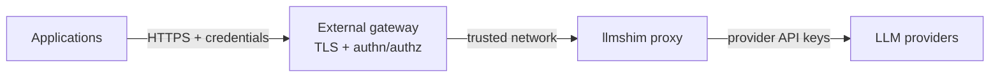

# Deploy the proxy safely

The llmshim proxy has **no built-in authentication and no TLS**. It also sends
permissive CORS headers. Do not expose it directly to an untrusted network.

The supported public topology puts an authentication and TLS gateway in front
of the proxy:



The gateway can be any reverse proxy or API gateway that terminates TLS,
authenticates callers, authorizes access, and applies your network policy.
Keep the llmshim listener reachable only from that trusted boundary.

## Install a proxy-enabled binary

The HTTP server is behind the Rust `proxy` feature:

```bash
cargo install llmshim --features proxy
```

The Homebrew tap also installs a proxy-enabled binary:

```bash
brew install sanjay920/tap/llmshim
```

Then configure at least one provider key and start the process:

```bash
export ANTHROPIC_API_KEY="..."
llmshim proxy
```

The default address is `0.0.0.0:3000`. Override it with environment variables:

```bash
LLMSHIM_HOST=127.0.0.1 LLMSHIM_PORT=8080 llmshim proxy
```

`LLMSHIM_HOST` and `LLMSHIM_PORT` take precedence over the proxy host and port
in `~/.llmshim/config.toml`. Binding to `127.0.0.1` is a useful default when a
same-host gateway connects to the proxy.

## Keep provider keys server-side

The proxy process reads `OPENAI_API_KEY`, `ANTHROPIC_API_KEY`,
`GEMINI_API_KEY`, and `XAI_API_KEY`. Language clients send neither those keys
nor provider authorization headers. Store the keys in the process environment
or the proxy's local config file, using your deployment platform's secret
mechanism.

Do not bake keys into an image, return them to clients, or place them in
`provider_config`. The latter is request data forwarded to adapters, not a
secret store.

## Container boundary

A minimal deployment has one llmshim process per container or service unit:

```text
public client
    -> HTTPS/auth gateway
        -> private llmshim:3000
            -> provider APIs
```

Give the process outbound HTTPS access to the configured providers and inbound
access only from the gateway or trusted callers. Use `GET /health` for process
health; it confirms the proxy is running and lists configured providers, but
does not call upstream APIs.

For multiple replicas and coordinated limits, continue to
[Scaling and rate limits](scaling.md). For every deployment setting, see the
[configuration reference](../reference/configuration.md).
