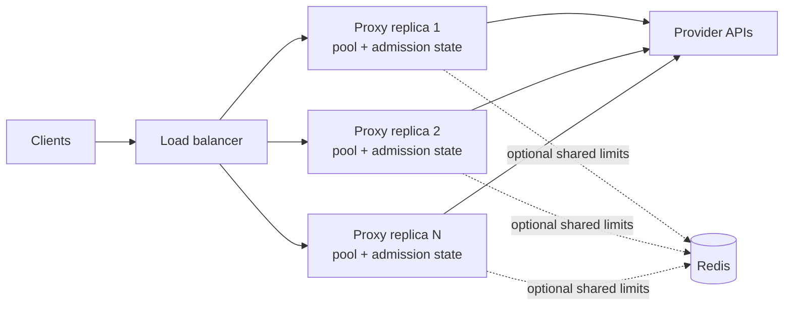

# Scaling and rate limits

The proxy is stateless per request. Put replicas behind a load balancer and
send the complete conversation history on every call. No sticky session is
required for llmshim itself.



Each process owns its connection pool, concurrency semaphore, and—unless
Redis coordination is enabled—its rate-limit buckets.

## Connection reuse and warmup

All calls in one process share a lazily initialized HTTP client. Its pool uses
HTTP/2 where available, gzip/brotli/zstd/deflate compression, a 90-second idle
timeout, up to four idle connections per host, a 30-second TCP keepalive, and
TCP `NODELAY`.

For Rust services, call `llmshim::warmup(&router).await` after constructing the
Router. It sends bounded HEAD requests to configured built-in provider origins
to pre-establish TCP and TLS connections. Failure to warm a provider is
ignored; normal request handling remains authoritative.

## Reactive retries

The shared client retries transport failures and HTTP `429`, `500`, `502`,
`503`, `504`, and `529`. The default is three retries after the initial
request—up to four attempts total—with exponential backoff and jitter.
`Retry-After` and recognized OpenAI or Anthropic reset headers take precedence
over computed backoff.

| Variable | Default | Meaning |
|---|---:|---|
| `LLMSHIM_MAX_RETRIES` | `3` | Retries after the initial attempt |
| `LLMSHIM_MAX_BACKOFF_SECS` | `60` | Cap for any one wait |

These retries stay on the same route. A non-streaming fallback chain adds a
second layer: **retry the route, then change the route**. See
[Fallback chains](../guides/fallbacks.md).

## Backpressure and proactive limits

Every proxy request first acquires an instance concurrency slot. Waiting
longer than the queue timeout returns `503` with `Retry-After`.

| Variable | Default | Meaning |
|---|---:|---|
| `LLMSHIM_MAX_CONCURRENCY` | `256` | Maximum in-flight upstream requests per replica |
| `LLMSHIM_QUEUE_TIMEOUT_MS` | `5000` | Maximum wait for a slot |

Optional token buckets can reject work before it reaches a provider. A
rejection is `429` with `Retry-After`.

| Variable | Default | Meaning |
|---|---:|---|
| `LLMSHIM_RATE_LIMIT_RPM` | unset | Requests per minute, used as the per-provider default |
| `LLMSHIM_RATE_LIMIT_TPM` | unset | Estimated tokens per minute, used as the per-provider default |
| `LLMSHIM_<PROVIDER>_RPM` | unset | Override RPM for `OPENAI`, `ANTHROPIC`, `GEMINI`, or `XAI` |
| `LLMSHIM_<PROVIDER>_TPM` | unset | Override TPM for that provider |
| `LLMSHIM_PENALTY_SECS` | `5` | Bucket penalty after an upstream `429` |

When neither RPM nor TPM is set, proactive rate limiting is disabled;
concurrency backpressure still applies. Token permits are estimates based on
request size and requested output, not provider billing measurements.

For an authenticated gateway identity, an omitted `rpm` or `tpm` field means
that dimension is unlimited. An explicit `0` means that dimension admits no
requests; the gateway rejects before dispatch and does not consume the other
tenant bucket. This tenant policy is separate from the global provider rate
limiter, whose configured zero values retain its existing provider-level
behavior.

## Provider health

Rate limiting and health are different questions. A `429` means the provider is
alive and asking for less, and the token buckets already slow it down. A
circuit breaker counts what retrying cannot fix — `500`, `502`, `503`, `504`,
`529` and transport failures — over a sliding window, opens the circuit at the
threshold, and admits a single probe after the cooldown.

| Variable | Default | Meaning |
|---|---:|---|
| `LLMSHIM_BREAKER_WINDOW_SECS` | `60` | Sliding window over which failures are counted |
| `LLMSHIM_BREAKER_TRIP_THRESHOLD` | `3` | Failures that open a circuit; `0` disables the breaker |
| `LLMSHIM_BREAKER_COOLDOWN_SECS` | `30` | Time an open circuit waits before admitting a probe |

Every dispatch path *observes* outcomes, so health accrues from ordinary
traffic. Only a [fallback chain](../guides/fallbacks.md) *refuses*: it skips a
provider with an open circuit instead of spending its retry budget on a target
it already knows is dead. A single-target request is still dispatched — with no
alternative, refusing would only convert an upstream failure into a local one.

## Spend caps

The experimental gateway enforces a per-identity USD cap beside the RPM/TPM
buckets. A gateway key's identity may carry `budget_usd` and an optional
`budget_window_secs` (default one day); over budget is a `429` with
`Retry-After` set to the window reset.

```json
{"sk-example": {"tenant": "acme", "tier": 1, "budget_usd": 100, "budget_window_secs": 86400}}
```

Cost is only knowable after a response, so the cap is checked before dispatch and
charged after. Everything admitted between the last charge and the next check
passes, so the overshoot bound is **admitted concurrency × the most expensive
request**, multiplied again across replicas that have not yet shared their
ledger. Size a cap with that headroom in mind rather than as a hard ceiling.

A response the catalog cannot price at all is **not** charged — recording zero
would let an unpriced model run forever under a budget. A model that prices only
*some* token classes is charged at its highest published rate for the rest, so a
partial price bounds the charge from above instead of voiding it: 2,537 of the
7,461 priced models in the catalog publish no `cache_read` rate, and voiding
those would have reopened this same hole one layer down. So that a cap cannot silently stop
binding, a request whose target has **no catalog price is refused before it runs**
when a budget is set:

```
400 {"error":{"code":"unpriceable_under_budget","param":"model", …}}
```

It is deliberately not a `429`: retrying never clears it. Three ways forward —
use a priced model, add a local price override in the catalog, or accept the risk
explicitly per key:

```json
{"sk-example": {"tenant": "acme", "budget_usd": 100, "budget_allow_unpriced": true}}
```

`budget_allow_unpriced` defaults to `false`. With it set, those requests run and
are not charged, and each one logs a warning and increments
`llmshim_gateway_unpriced_under_cap_total{provider,model}` — a non-zero counter
means the budget is not binding for that target. An accepted risk should stay
measurable rather than become an assumption.

## One replica or a coordinated fleet

The default buckets are in memory. With `N` replicas, each replica enforces
its own configured limit. If the number represents a fleet-wide provider
quota, divide it across instances or enable shared coordination.

To share one bucket, build the opt-in feature and set Redis:

```bash
cargo install llmshim --features redis-coordination
LLMSHIM_REDIS_URL=redis://redis.internal:6379 llmshim proxy
```

`redis-coordination` includes the `proxy` feature. Redis coordinates rate-limit
buckets, provider health and — on the gateway — spend, so a shared limit, a
dead provider and a dollar cap all mean the same thing on every replica;
connection pools and concurrency limits remain per process. If
Redis becomes unavailable at runtime, limiting fails open so requests continue.
If the Redis client cannot be initialized—or the binary lacks the feature—the
proxy warns and falls back to in-memory buckets.

Do not infer capacity from llmshim's implementation details alone. The
[README benchmarks](https://github.com/sanjay920/llmshim#benchmarks) are the
maintained performance snapshot; load-test your model mix, payload sizes,
provider quotas, and gateway before choosing replica counts.
