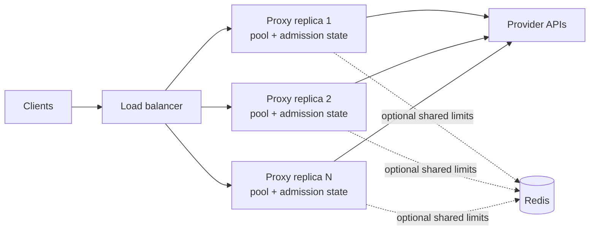

# Scaling and rate limits

The proxy is stateless per request. Put replicas behind a load balancer and
send the complete conversation history on every call. No sticky session is
required for llmshim itself.



Each process owns its connection pool, concurrency semaphore, and—unless
Redis coordination is enabled—its rate-limit buckets.

## Connection reuse and warmup

All calls in one process share a lazily initialized HTTP client. Its pool uses
HTTP/2 where available, gzip/brotli/zstd/deflate compression, a 90-second idle
timeout, up to four idle connections per host, a 30-second TCP keepalive, and
TCP `NODELAY`.

For Rust services, call `llmshim::warmup(&router).await` after constructing the
Router. It sends bounded HEAD requests to configured built-in provider origins
to pre-establish TCP and TLS connections. Failure to warm a provider is
ignored; normal request handling remains authoritative.

## Reactive retries

The shared client retries transport failures and HTTP `429`, `500`, `502`,
`503`, `504`, and `529`. The default is three retries after the initial
request—up to four attempts total—with exponential backoff and jitter.
`Retry-After` and recognized OpenAI or Anthropic reset headers take precedence
over computed backoff.

| Variable | Default | Meaning |
|---|---:|---|
| `LLMSHIM_MAX_RETRIES` | `3` | Retries after the initial attempt |
| `LLMSHIM_MAX_BACKOFF_SECS` | `60` | Cap for any one wait |

These retries stay on the same route. A non-streaming fallback chain adds a
second layer: **retry the route, then change the route**. See
[Fallback chains](../guides/fallbacks.md).

## Backpressure and proactive limits

Every proxy request first acquires an instance concurrency slot. Waiting
longer than the queue timeout returns `503` with `Retry-After`.

| Variable | Default | Meaning |
|---|---:|---|
| `LLMSHIM_MAX_CONCURRENCY` | `256` | Maximum in-flight upstream requests per replica |
| `LLMSHIM_QUEUE_TIMEOUT_MS` | `5000` | Maximum wait for a slot |

Optional token buckets can reject work before it reaches a provider. A
rejection is `429` with `Retry-After`.

| Variable | Default | Meaning |
|---|---:|---|
| `LLMSHIM_RATE_LIMIT_RPM` | unset | Requests per minute, used as the per-provider default |
| `LLMSHIM_RATE_LIMIT_TPM` | unset | Estimated tokens per minute, used as the per-provider default |
| `LLMSHIM_<PROVIDER>_RPM` | unset | Override RPM for `OPENAI`, `ANTHROPIC`, `GEMINI`, or `XAI` |
| `LLMSHIM_<PROVIDER>_TPM` | unset | Override TPM for that provider |
| `LLMSHIM_PENALTY_SECS` | `5` | Bucket penalty after an upstream `429` |

When neither RPM nor TPM is set, proactive rate limiting is disabled;
concurrency backpressure still applies. Token permits are estimates based on
request size and requested output, not provider billing measurements.

## One replica or a coordinated fleet

The default buckets are in memory. With `N` replicas, each replica enforces
its own configured limit. If the number represents a fleet-wide provider
quota, divide it across instances or enable shared coordination.

To share one bucket, build the opt-in feature and set Redis:

```bash
cargo install llmshim --features redis-coordination
LLMSHIM_REDIS_URL=redis://redis.internal:6379 llmshim proxy
```

`redis-coordination` includes the `proxy` feature. Redis is used for rate-limit
coordination; connection pools and concurrency limits remain per process. If
Redis becomes unavailable at runtime, limiting fails open so requests continue.
If the Redis client cannot be initialized—or the binary lacks the feature—the
proxy warns and falls back to in-memory buckets.

Do not infer capacity from llmshim's implementation details alone. The
[README benchmarks](https://github.com/sanjay920/llmshim#benchmarks) are the
maintained performance snapshot; load-test your model mix, payload sizes,
provider quotas, and gateway before choosing replica counts.
