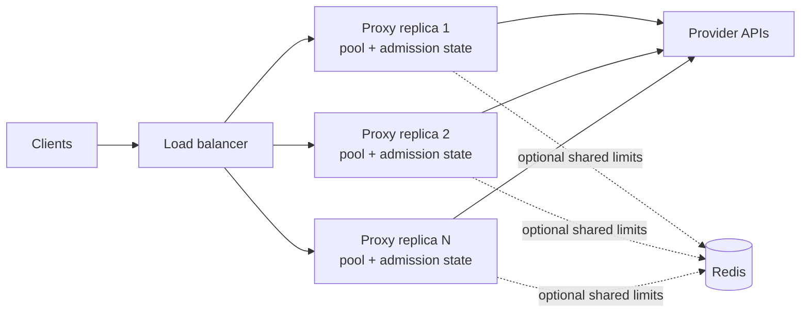

# Scaling and rate limits

The proxy is stateless per request. Put replicas behind a load balancer and
send the complete conversation history on every call. No sticky session is
required for llmshim itself.



Each process owns its connection pool, concurrency semaphore, and—unless
Redis coordination is enabled—its rate-limit buckets.

## Connection reuse and warmup

All calls in one process share a lazily initialized HTTP client. Its pool uses
HTTP/2 where available, gzip/brotli/zstd/deflate compression, a 90-second idle
timeout, up to four idle connections per host, a 30-second TCP keepalive, and
TCP `NODELAY`.

For Rust services, call `llmshim::warmup(&router).await` after constructing the
Router. It sends bounded HEAD requests to configured built-in provider origins
to pre-establish TCP and TLS connections. Failure to warm a provider is
ignored; normal request handling remains authoritative.

## Reactive retries

The shared client retries transport failures and HTTP `429`, `500`, `502`,
`503`, `504`, and `529`. The default is three retries after the initial
request—up to four attempts total—with exponential backoff and jitter.
`Retry-After` and recognized OpenAI or Anthropic reset headers take precedence
over computed backoff. Invalid reset durations are ignored; oversized finite
durations saturate safely before the configured cap and jitter are applied.

| Variable | Default | Meaning |
|---|---:|---|
| `LLMSHIM_MAX_RETRIES` | `3` | Retries after the initial attempt |
| `LLMSHIM_MAX_BACKOFF_SECS` | `60` | Cap for any one wait |

These retries stay on the same route. A non-streaming fallback chain adds a
second layer: **retry the route, then change the route**. See
[Fallback chains](../guides/fallbacks.md).

## Backpressure and proactive limits

Every logical request first acquires an instance preparation slot before route
resolution, schema work, or provider preparation. Each actual provider attempt
then acquires a separate concurrency slot immediately before the send. Both
waits use the queue timeout and return `503` with `Retry-After` when saturated.
The logical slot remains held for the request or stream lifetime. A retry or
repair releases the completed attempt's slot and must acquire again; fallback
acquires against the provider it actually targets without reacquiring the
logical slot.

The authenticated gateway checks credentials before acquiring its short-lived
prequeue preparation slot. It releases that slot after native conversion,
route expansion, token estimation, keyed request fingerprinting, and policy
checks. Distributed mode retains it through finite-queue admission and then
releases it before waiting for execution or results; local mode releases before
its synchronous in-memory enqueue. Queued dispatch and each final provider
attempt keep their independent capacity and rate-policy gates. Post-queue
gateway response projection is outside this short-lived prequeue slot.

| Variable | Default | Meaning |
|---|---:|---|
| `LLMSHIM_MAX_CONCURRENCY` | `256` | Maximum in-flight upstream requests per replica |
| `LLMSHIM_QUEUE_TIMEOUT_MS` | `5000` | Maximum wait for a slot |

Optional token buckets can reject work before it reaches a provider. A
rejection is `429` with `Retry-After`.

| Variable | Default | Meaning |
|---|---:|---|
| `LLMSHIM_RATE_LIMIT_RPM` | unset | Requests per minute, used as the per-provider default |
| `LLMSHIM_RATE_LIMIT_TPM` | unset | Estimated tokens per minute, used as the per-provider default |
| `LLMSHIM_<PROVIDER>_RPM` | unset | Override RPM for `OPENAI`, `ANTHROPIC`, `GEMINI`, or `XAI` |
| `LLMSHIM_<PROVIDER>_TPM` | unset | Override TPM for that provider |
| `LLMSHIM_PENALTY_SECS` | `5` | Bucket penalty after an upstream `429` |

When neither RPM nor TPM is set, proactive rate limiting is disabled;
concurrency backpressure still applies. Token permits are estimates based on
the final provider-native body and authoritative prepared target. They include
the serialized native prompt and schema material, recognized native reasoning
budgets, and the effective native output limit.
For Chat Completions, a null `max_completion_tokens` does not hide a numeric
`max_tokens` limit; a numeric `max_completion_tokens` retains precedence.
Recognized output limits must use unsigned JSON integers or null for TPM
estimation. Other representations, including quoted integers and floats that
a backend may coerce, reserve the maximum token estimate instead of silently
falling back to an omitted-limit default. This affects TPM admission only;
the forwarded request is unchanged. Use integer JSON values for bounded
output allowances.
For native Chat Completions bodies, OpenAI's `n` is treated as a generated
candidate count; Gemini `generationConfig.candidateCount` is treated the same
way. The output allowance is multiplied by the final wire candidate count. The
estimator also defensively recognizes `best_of`, `bestOf`, and
`candidate_count`, including a `generation_config` container that llmshim can
preserve from `x-gemini`, when a final body contains them; that compatibility
handling does not imply universal provider support.
Anthropic's omitted output limit uses
the adapter's 8,192-token default; other known models use the catalog output
ceiling when the provider leaves the limit unspecified. Unknown hosted models
use a conservative provider-family ceiling; unknown self-hosted models retain
the 1,024-token fallback because the server's launch configuration is not
visible to llmshim. OpenRouter `models` fallbacks remain supported; when no
explicit output limit is present, every listed model contributes its catalog
ceiling and an unknown listed model uses a one-million-token ceiling.

These permits are conservative estimates, not provider billing measurements.
The input side uses serialized characters divided by four; provider tokenizers,
images, caching, and unknown self-hosted model defaults can differ. Admission
occurs once per actual network attempt. Transport retries, managed schema
repairs, and supported fallback targets each reacquire RPM and TPM from the lane
for the provider/body that will be sent. A provider-wide refusal may advance a
fallback chain only to a distinct provider; an authenticated tenant refusal
terminates the request.

For an authenticated gateway identity, an omitted `rpm` or `tpm` field means
that dimension is unlimited. An explicit `0` means that dimension admits no
requests; the gateway rejects before dispatch and does not consume the other
tenant bucket. The same deny-all behavior applies to global and per-provider
rate-limit values: an explicit zero returns `429` before dispatch, while an
omitted value remains unlimited.

## Provider health

Rate limiting and health are different questions. A `429` means the provider is
alive and asking for less, and the token buckets already slow it down. A
circuit breaker counts what retrying cannot fix — `500`, `502`, `503`, `504`,
`529` and transport failures — over a sliding window, opens the circuit at the
threshold, and admits a single probe after the cooldown.

| Variable | Default | Meaning |
|---|---:|---|
| `LLMSHIM_BREAKER_WINDOW_SECS` | `60` | Sliding window over which failures are counted |
| `LLMSHIM_BREAKER_TRIP_THRESHOLD` | `3` | Failures that open a circuit; `0` disables the breaker |
| `LLMSHIM_BREAKER_COOLDOWN_SECS` | `30` | Time an open circuit waits before admitting a probe |

Every dispatch path *observes* outcomes, so health accrues from ordinary
traffic. Only a [fallback chain](../guides/fallbacks.md) *refuses*: it skips a
provider with an open circuit instead of spending its retry budget on a target
it already knows is dead. A single-target request is still dispatched — with no
alternative, refusing would only convert an upstream failure into a local one.

## Spend caps

The experimental gateway enforces a per-identity USD cap beside the RPM/TPM
buckets. A gateway key's identity may carry `budget_usd` and an optional
`budget_window_secs` (default one day); over budget is a `429` with
`Retry-After` set to the window reset.

```json
{"sk-example": {"tenant": "acme", "tier": 1, "budget_usd": 100, "budget_window_secs": 86400}}
```

`budget_usd` must be finite, non-negative, and no greater than
`9007199.254740992`. The ledger stores nano-USD integers and keeps every Redis
value within Lua's exact-integer range; invalid limits fail closed.

Every actual provider send reserves a conservative amount before it consumes
RPM or TPM. The reservation uses the final provider-native model and body, the
catalog context ceiling, the request's output/reasoning bound (or the catalog
output ceiling), and the applicable catalog price tier. The rate debits and USD
reservation commit together, so a budget refusal consumes neither allowance.
The full context ceiling is used for input rather than treating a tokenizer
heuristic as a guarantee, so admission can be deliberately conservative even
for a short prompt.
Repeated usage snapshots upsert one attempt by UUID; they are never summed as
separate bills. A terminal response with known usage replaces its reservation
with the known charge. Failed repair responses are therefore charged even when
the caller ultimately receives a local `502`.

Transport uncertainty, cancellation, stream abandonment, worker loss, and a
failed settlement keep the original reservation in its acquisition window.
Rollover never moves that liability into a later window. This makes the cap a
hard ceiling under the configured catalog pricing policy. Catalog prices are
still estimates rather than provider invoices: an external price change or fee
missing from the policy cannot be guaranteed by llmshim.

Strict admission rejects a request when it cannot form that bound. This includes
an unknown price or context/output ceiling, variable OpenRouter routing,
priority/fast service controls, provider-hosted tools, and cache-creation
controls whose fee dimension is not bounded. The rejection happens before send:

```
400 {"error":{"code":"unpriceable_under_budget","param":"model", …}}
```

It is deliberately not a `429`: retrying never clears it. Use a bounded model,
add a complete local catalog policy, remove the unbounded control, or accept the
risk explicitly per key:

```json
{"sk-example": {"tenant": "acme", "budget_usd": 100, "budget_allow_unpriced": true}}
```

`budget_allow_unpriced` defaults to `false`. With it set, only requests lacking a
defensible reservation receive the exception. Already-known spend must remain
below the cap. Such an attempt conservatively holds the remaining window balance
until final known usage can replace it; uncertainty or abandonment therefore
exhausts the cap rather than releasing zero. Any later provider-reported or
catalog-derived charge is still recorded. Priceable requests reserve normally
even when the flag is set. Each exception increments
`llmshim_gateway_unpriced_under_cap_total{provider,model}`; a non-zero counter
means the configured policy cannot promise a finite bound for that target.

## One replica or a coordinated fleet

The default buckets are in memory. With `N` replicas, each replica enforces
its own configured limit. If the number represents a fleet-wide provider
quota, divide it across instances or enable shared coordination.

To share one bucket, build the opt-in feature and set Redis:

```bash
cargo install llmshim --features redis-coordination
LLMSHIM_REDIS_URL=redis://redis.internal:6379 llmshim proxy
```

`redis-coordination` includes the `proxy` feature. Redis coordinates provider
rate-limit buckets, provider health and — on the authenticated gateway — tenant
RPM/TPM and spend, so these limits mean the same thing on every replica. The
gateway checks provider and tenant RPM/TPM in one Lua decision: if any dimension
rejects, none is debited. Its trusted per-attempt coordinator fails closed when
Redis is unavailable. The compact proxy's standalone Redis limiter keeps its
documented fail-open behavior. Both paths share the same provider bucket keys.
Connection pools and concurrency limits remain per process. If the Redis client
cannot be initialized—or the binary lacks the feature—the compact proxy warns
and falls back to in-memory buckets.

With `gateway-redis`, admitting a new job checks the provider's waiting-queue
depth and inserts the job in one Lua transaction. Concurrent origins cannot
claim the same remaining slot. `LLMSHIM_GATEWAY_QUEUE_DEPTH` defaults to 10,000
waiting jobs per provider; a full queue refuses new work with `503` and
`Retry-After`.

Drain distributed gateway queues before a rolling upgrade that changes the
trusted policy envelope. Workers reject older unversioned descriptors rather
than dispatching them without their originating tenant budget.

Do not infer capacity from llmshim's implementation details alone. The
[README benchmarks](https://github.com/sanjay920/llmshim#benchmarks) are the
maintained performance snapshot; load-test your model mix, payload sizes,
provider quotas, and gateway before choosing replica counts.
